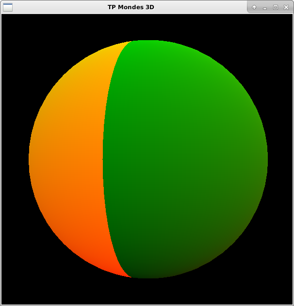
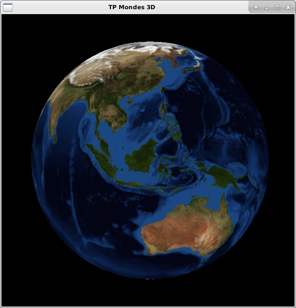
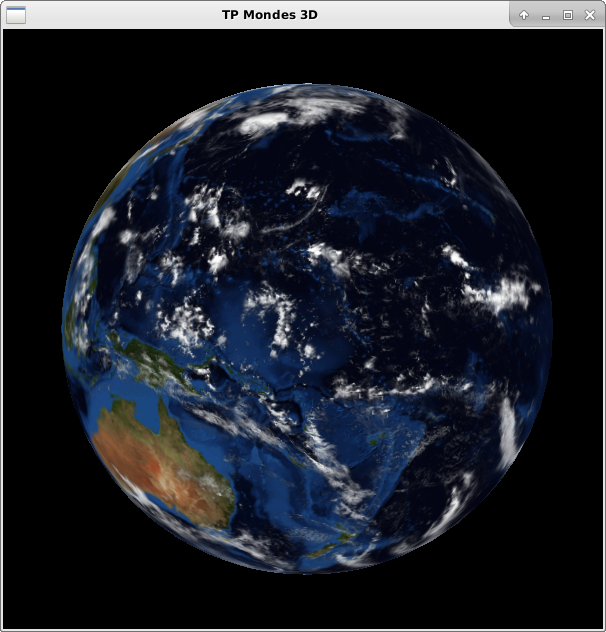
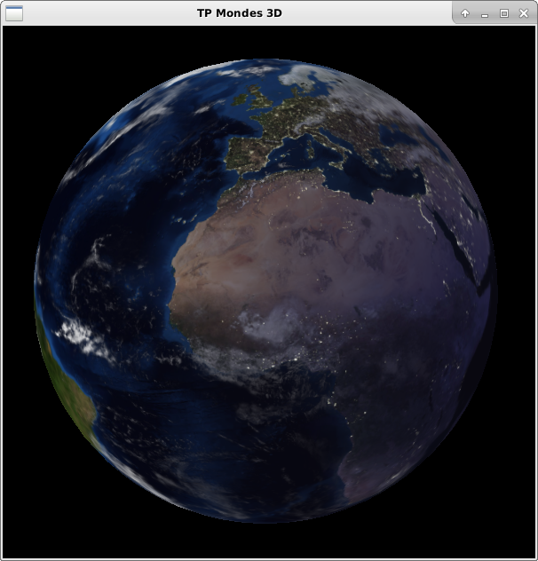
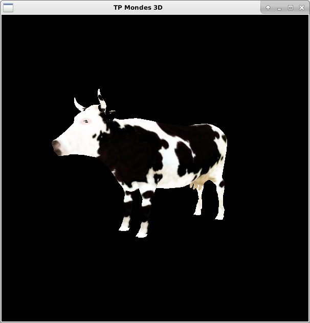
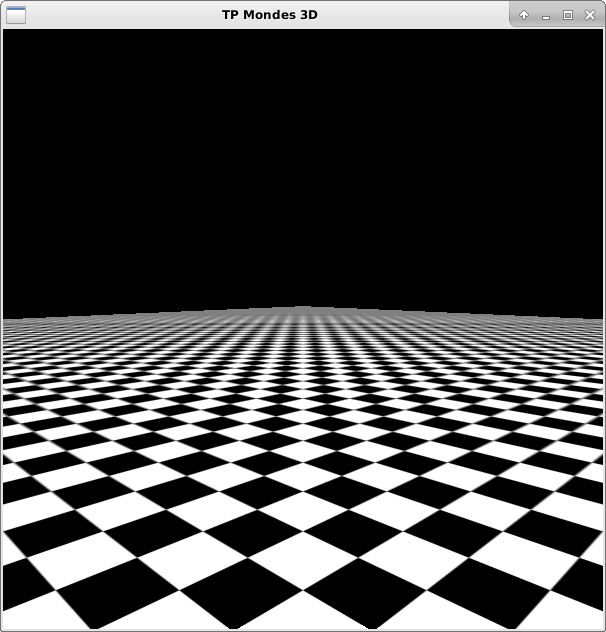
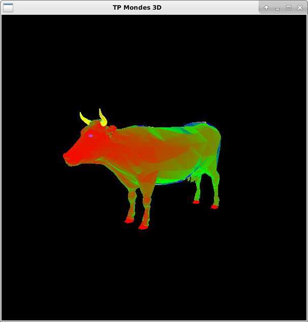
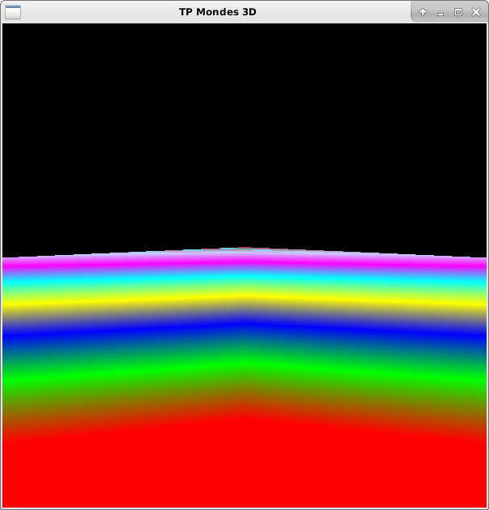

# mondes3D

Avancement
==========

Des images illustrant les résultats de chaque exercice ont été prises afin de vérifier visuellement les fonctionnalités.
Les commentaires "TODO" n'ont pas été enlevés pour retrouver plus facilement tout ce qui a été implémenté.

1) Introduction
---------------

J'ai appliqué des changements dans les shaders comme suit :

pour simple.frag :

	out_color = vec4(v_tex, 0, 1);
	
pour simple.vert :
	
	v_tex = vtx_texcoord;

avec v_tex, un vec2 en in et out.

Image résultante :

2) Placage de texture
---------------------

J'ai chargé la texture de la Terre dans tex0 (je l'ai créé dans viewer.h) et vérifié qu'elle est bien chargée, sinon le programme crash avec rapport d'erreur. Puis j'ai passé cette texture à partir de son identifiant aux shaders dans tex2D0 afin de procéder au changement de couleur.

Pour l'ajout de nuages, j'ai chargé la texture de manière analogue et j'ai modifié le calcul de out_color par :

	vec4 normalEarth = texture(tex2D0, v_tex);
	vec4 cloud = texture(tex2D1, v_tex);
	vec4 tmp = mix(normalEarth, cloud, cloud);
	out_color = tmp;
	
Résultat :

J'ai enfin fait les mix avec les résultats précédents et une nouvelle texture pour faire la nuit. Sans trop de détails, avec un raisonnement similaire (avec en plus un poids) j'ai obtenu ceci :

3) Filtrage
-----------

j'ai appliqué un filtre sur le damier avec un nouvel angle de vue et en désactivant la rotation, voici l'angle pris pour la suite : 

	_cam.lookAt(Vector3f(8,1,8), Vector3f(0,0,0), Vector3f(0,1,0));

Voici le résultat obtenu initialement sur le damier :

J'ai par la suite modifié les touches (données initialement) pour avoir _minFilter modifié si l'on appuie sur les touches directionnelles et _magFilter modifié si l'on appuie sur les touches de changement de page.

J'ai testé sur le damier, mais aussi sur la vache :

Voici mon filtre préféré :

	_minFilter = GL_LINEAR_MIPMAP_LINEAR;

Pour la partie mip-map, j'ai fait quelques tests et j'ai l'impression que ça ne prend plus en compte les filtres...
Voici 2 des exemples de mes tests :

Difficultés rencontrées
=======================

Je n'ai pas eu de réelle difficulté cette fois.
